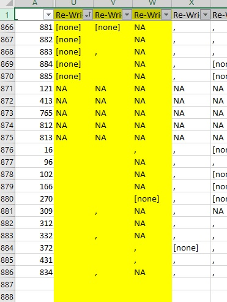
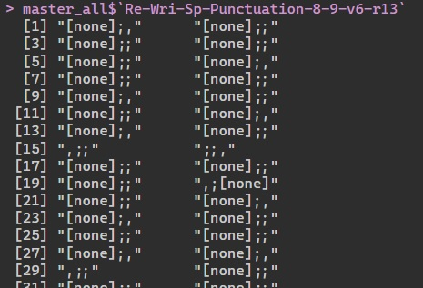

```{r setup, include=FALSE}
knitr::opts_chunk$set(echo = TRUE)
knitr::opts_chunk$set(eval = FALSE)
library(openxlsx)


```

```{r checkcheck(df), include=FALSE}
checkcheck <- function(df) {
  # Write the data frame to a CSV file
  write.csv(df, file = "checkcheck.csv")
  shell.exec("checkcheck.csv")
}
``` 
# Purpose
This script can be used to create a master data frame for all radar administrations of you choice. Most likely, it will be used to pull together all existing administration exports from Cirrus into one master sheet, either NED or ENG. Both are possible. 

The data will be raw data, which means that special care must be taken to address some of the issues that have arisen earlier - i.e., some characters cause problems, some answers have spaces after them, etc. 

The raw data will also be set up to include section scores, which means the scores for each task - for a total of 15. 

Caution: There will also be questions for which the answer contains several parts separated by ;. This requires some manual input. For the purposes of R Markdown, All code is set to eval=FALSE. 

## Setup
In one folder, put all files from Cirrus with the name corresponding their administration e.g. LETNED22232e (that is, LET - letteren, NED - nederlands, 2223 - academic year 22-23, 2e - tweede gelegenheid). This name is important as it will be used later to construct test taker IDs. These test taker IDs may be used later to cross reference the responses from individual test takers in the original data later on. 

All files should be csv. 

## Specify Path, Grab Files
folder_path: where the Cirrus exports are: **Change as needed**.<br>
file_names: a vector of all files in folder_path<br>
radarlist: a list containing [[i]] dfs for i files in file_names<br>

```{r}
folder_path <- "C:/Users/mtcza/OneDrive/Documents/GitHub/22231e/Eng_Raw"
file_names <- list.files(folder_path, pattern = "\\.csv")
file_names # a vector containing all file names in directory
```
## Create radarlist[[x]] ...
... which contains at [[i]] the data frame of one of the files in the target folder, i.e., one Cirrus export. The name of each will also be drawn from the file name. 
```{r}
radarlist <- list()
# Use a for loop to read each CSV file and create a new data frame with the desired name
for (file_name in file_names) {
  file_path <- file.path(folder_path, file_name)
  df <- read.csv(file_path)
  df_name <- sub("\\.csv$", "", file_name)  # Remove the ".csv" extension
  radarlist[[df_name]] <- df
}
```
## Add col TESTTAKER..
...in each df in list 'radarlist', a new col is added at the front, TESTTAKER, which contains IDs: file name + number, e.g. LETENG22231e33, for the 33rd test taker in administration LETENG22231e.
```{r}
names <- names(radarlist)
for (i in seq_along(radarlist)) {
  # Get the number of rows in the current data frame
  num_rows <- nrow(radarlist[[i]])
  # Create the TESTTAKER values (i.e., names[i] plus a number from 1 to the number of rows)
  name <- rep(names[i], times = num_rows)
  nums <- 1:num_rows
  name_nums <- paste0(name, nums) # new column with testtaker ids
  # Create a new data frame with TESTTAKER column
  new_col_df <- data.frame(TESTTAKER = name_nums)
  # Combine the new TESTTAKER column with the current data frame in radarlist
  radarlist[[i]] <- cbind(new_col_df, radarlist[[i]])
}
```
## transfer Hotspot item scoers
the scores for the hotspot item are currently stored in the column 
Sectieresultaat.2 rather than the actual column with the item name. At this stage, we need to transfer these scores over before we make a master sheet. 
First, let's inspect the list in excel. The below code opens an excel sheet with a worksheet for each test administration in the list.
```{r}

# Create a new workbook
wb <- createWorkbook()

# Add each data frame as a new worksheet in the workbook
for (i in seq_along(radarlist)) {
  addWorksheet(wb, sheetName = paste0("Sheet", i))
  writeData(wb, sheet = i, x = radarlist[[i]])
}

# Save the workbook to a file
saveWorkbook(wb, "output_file.xlsx", overwrite = TRUE)
shell.exec("output_file.xlsx")

```
now let's put the hotspot scores in the right column. 
```{r}
copy_and_paste_hotspot_values <- function(df) {
  # Check if 'Sectieresultaat.2' column exists
  if ("Sectieresultaat.2" %in% colnames(df)) {
    # Identify the columns containing 'hotspot' in their names (case-insensitive)
    hotspot_cols <- grepl("hotspot", colnames(df), ignore.case = TRUE)
  
    # Check if there are any hotspot columns
    if (any(hotspot_cols)) {
      # Copy values from 'Sectieresultaat.2' column and paste them to hotspot columns
      sectieresultaat_values <- df[["Sectieresultaat.2"]]
      df[, hotspot_cols] <- sectieresultaat_values
    }
  }
  return(df)
}
# Cycle through each data frame in the radarlist
modified_radarlist <- lapply(radarlist, copy_and_paste_hotspot_values)
```
Check again by opening an excel sheet, look at the hotspot columns, are the scores there?
```{r}

# Create a new workbook
wb <- createWorkbook()

# Add each data frame as a new worksheet in the workbook
for (i in seq_along(modified_radarlist)) {
  addWorksheet(wb, sheetName = paste0("Sheet", i))
  writeData(wb, sheet = i, x = modified_radarlist[[i]])
}

# Save the workbook to a file
saveWorkbook(wb, "output_file.xlsx", overwrite = TRUE)
shell.exec("output_file.xlsx")

```
If that all looks OK, then move on.
## Fill master df 'master_all' ...

... by first finding the cols in common, and then using merge() in a for-loop to layer each df in modified_radarlist
```{r}
#create empty data frame master_all
master_all <- data.frame(modified_radarlist[[1]])

for (i in 2:length(modified_radarlist)) {
  colnames1 <- colnames(master_all)
  colnames2 <- colnames(modified_radarlist[[i]])
  common_cols <- intersect(colnames1, colnames2)
  master_all <- merge(x=master_all, y=modified_radarlist[[i]], 
                  by=common_cols, all.x=TRUE, all.y=TRUE)

}
# Replace all full stops with hyphens in column names
colnames(master_all) <- gsub("\\.", "-", colnames(master_all))

```
# Semicolon-separated data 
## Find cols with ; ...
... which indicate that one particular question has multiple answers separated by semi-colons. These can be tricky to separate in some cases, so let's start by identifying them. Run the code below and inspect the output. The table lists the items with semicolons somewhere in the recorded responses, and next to that the first non-NA response by test takers. Inspecting this list will let you know whether the item in question really is semicolon-divied or is there just a semicolon somewhere in one option. 
```{r}
semicolon_cols <- c()
# Loop through each column in the data frame
for (col_name in names(master_all)) {
  # Check if any element in the column contains a semicolon
  if (any(grepl(";", master_all[[col_name]]))) {
    semicolon_cols <- c(semicolon_cols, col_name)
  }
}
first_non_na_values <- vector("character", length(semicolon_cols))

# Loop through each column in semicolon_cols
for (i in seq_along(semicolon_cols)) {
  col_name <- semicolon_cols[i]
  first_non_na_values[i] <- na.omit(master_all[[col_name]])[1]
}
# Create a data frame with semicolon_cols as the first column and first_non_na_values as the second column
semicolon_results <- data.frame(Num=(1:length(first_non_na_values)), Answer=first_non_na_values) 
semicolon_results

``` 

### Inspect semicolon_answers ...
... the program asks for input at this stage - y or n whether the answer is a true semi-colon separated answer or not. 


```{r} 
# Assuming result_df is the data frame with semicolon_cols as the first column and first_non_na_values as the second column

# Initialize an empty vector to store user responses
semicolon_answers <- vector("character", length(first_non_na_values))

# Loop through each value in first_non_na_values and prompt the user for input
for (i in seq_along(first_non_na_values)) {
  value <- first_non_na_values[i]
  
  # Prompt the user for input (y or n)
  response <- readline(paste("Semicolon separated?",value))
  
  # Check if the response is valid (y or n) and store it in semicolon_answers
  while (response != "y" && response != "n") {
    response <- readline("Invalid response. Please enter 'y' if it is a semicolon-separated answer, or 'n' if not: ")
  }
  
  semicolon_answers[i] <- response
}
```
Look at results in excel and check they are right.
```{r}

# Assuming semicolon_cols, semicolon_results, and semicolon_answers are defined as mentioned earlier

# Create a data frame with the three columns
semicolon_check <- data.frame(
  item = semicolon_cols,
  answer = first_non_na_values,
  true_or_not = semicolon_answers
)

# Sort the data frame by semicolon_answers in reverse alphabetical order
semicolon_check <- semicolon_check[order(semicolon_check$true_or_not, decreasing = TRUE), ]
checkcheck(semicolon_check)

```
If yes, carry on to the next step. If not, return to the code chunk above to enter y or n. 
```{r}
cols_with_semicolons <- semicolon_check$item[semicolon_check$true_or_not == 'y']
cols_with_semicolons
cols_with_semicolons_colnums <- match(cols_with_semicolons, colnames(master_all))
cols_with_semicolons_colnums
```
The above list shows which items we need to look at one by one and separate them out. 

```{r}
# Initialize an empty list to store the transformed data frames
deconstructed_semicolon_items <- list()

# Loop through each column index in cols_with_semicolons_colnums
for (j in cols_with_semicolons_colnums) {
  # Extract the column data and its name
  vector_data <- master_all[, j]
  name_of_col <- names(master_all)[j]

  # Split the vector elements by semicolons
  split_elements <- strsplit(vector_data, ";")

  # Find the maximum number of parts among all elements
  max_parts <- max(sapply(split_elements, length))

  # Create a data frame to store the transformed data
  transformed_data <- data.frame(matrix(NA, nrow = length(vector_data), ncol = max_parts))

  # Fill in the data frame with the sub-item parts
  for (i in seq_along(split_elements)) {
    if (length(split_elements[[i]]) > 0) {
      transformed_data[i, 1:length(split_elements[[i]])] <- split_elements[[i]]
    } else {
      transformed_data[i, ] <- NA
    }
  }

  # Rename the columns to include the sub-item numbers using name_of_col
  colnames(transformed_data) <- paste(name_of_col, seq_len(max_parts), sep = ".")

  # Add the transformed_data data frame to the list
  deconstructed_semicolon_items[[name_of_col]] <- transformed_data
}
# Update the column names of each data frame in the list
for (name in names(deconstructed_semicolon_items)) {
  colnames(deconstructed_semicolon_items[[name]]) <- sub("^.*\\.", "", colnames(deconstructed_semicolon_items[[name]]))
}

# Combine all the data frames in the list into one big data frame
combined_data <- do.call(cbind, deconstructed_semicolon_items)

# Print the combined data frame
print(combined_data)

```
At this point, combined_data is a data frame which contains all the new items. EXCEPT! the punctuation items likely need a closer look. Open the combined_data df in excel using checkcheck() and make any adjustments necessary to punctuation items by cross checking with cirrus about whether the semicolon is a response in any of the items. 

This is not always possible to do with full confidence. Consider the response ";;;," - I know there are three parts to this item, so two of these semicolons are breaking the three parts, but the first two parts have ; as an option as well for the answer. so the deconstructed answer is either "; - blank - ," or "blank - ; - ,"  In this case I'm choosing the latter because the answer to the first part is actually [none], but many people leave the dummy -blank- because they think this represents 'no punctuation needed'. 



\n 
See in the above example how the item in yellow seems to have three parts, but in fact only has 2. I have confirmed this by looking it up in Cirrus. I sort the first column first to look for blank answers. Then I cross reference with the exact participant numbers in the master_all$(insert item here) so that I can see exactly what the response pattern was for these tricky ones. 




Once done thusly inspecting all punctuation item cols, delete NA rows for punctuation items and save checkcheck.xlsx. Then run the next chunk below to import checkcheck.xlsx as combined_data_revised. 
```{r}
checkcheck(combined_data)
#you can inspect individual response patterns here too as below
#master_all$`Re-Wri-Sp-Punctuation-1-4-v7-r15`
```
create combined_data_revised. Check that the rows are in order - if not, go back and save again!

The below code imports the revised semicolon test response data back to R
```{r}
file_path <- "checkcheck.csv"
combined_data_revised <- read.csv(file_path)
print(head(combined_data_revised))

```
Now, let's combine combined_data_revised with master_all using cbind
```{r}
master_all2 <- cbind(master_all, combined_data_revised)
```
and delete the original semicolon-separated cols
```{r}
master_all3 <- master_all2[,-cols_with_semicolons_colnums]
```
## Trim Answers
```{r}
# Apply trimws to remove leading and trailing spaces from all columns in master_all3
master_all3 <- as.data.frame(lapply(master_all3, trimws))

```
## Inspect Answer Ranges for all items
It is a good idea to have a look at the range of answers given for each item. This will give us an idea of whether there is anything wrong with the data import, trimming, or indeed cirrus output. 

However, before we do that, we need to identify in the data whether a column is an item or some other information. The easiest way to do this is to create a data frame that can be manually inspected and edited in excel. 

```{r}
# Create a data frame with two columns: column names of master_all and NULL values
temp_excel <- data.frame(Test_Item = colnames(master_all), Blank_Column = character(length(colnames(master_all))), stringsAsFactors = FALSE)

# Display the resulting data frame
print(head(temp_excel))


```
Run the code below, which opens an excel sheet that has the col names in the first col and a blank second row. in the second row enter y for item and n for not item and save. Then run the code in the chunk below to import it back to R.

```{r}
# Create a data frame with two columns: column names of master_all and NULL values
temp_excel <- data.frame(Test_Item = colnames(master_all3), Blank_Column = character(length(colnames(master_all3))), stringsAsFactors = FALSE)

# Display the resulting data frame
checkcheck(temp_excel)
```
Check carefully that the first column is in order!
```{r}
# Replace "checkcheck.csv" with the appropriate file path if needed
file_path <- "checkcheck.csv"

# Import the CSV file as a data frame
is_item_or_not <- read.csv(file_path)

# Print the first few rows of the data frame to check if it's loaded correctly
print((is_item_or_not))
```
Now we can grab only only item cols into a new data frame called only_item_cols
```{r}
# Assuming master_all3 is your original data frame
# Assuming "Status" is the column name for the "y" or "n" values
# Assuming "Column_Name" is the column name for the names of the columns in master_all3

# Extract the column names with "y" value from is_item_or_not
selected_columns <- is_item_or_not[is_item_or_not$Blank_Column == "y", "X"]

# Create the new data frame 'only_item_cols' containing only the selected columns from master_all3
only_item_cols <- master_all3[, selected_columns]

# use below code to check 
#print(colnames(only_item_cols))


```
only_item_cols contains only those items from master_all3 which are items. We can now move on to inspect the range of responses for each item
```{r}
# Get the list of unique columns in 'only_item_cols'
unique_columns <- unique(names(only_item_cols))

# Create a function to create the data frames for each column
create_freq_df <- function(column_name) {
  column_values <- only_item_cols[[column_name]]
  freq_table <- table(column_values)
  df <- data.frame(
    unique_values = as.character(names(freq_table)),
    frequency = as.numeric(freq_table)
  )
  return(df)
}

# Use lapply to apply the function to each column and create the list of data frames
list_of_data_frames <- lapply(unique_columns, create_freq_df)

# Assign names to the list elements based on the column names in 'only_item_cols'
names(list_of_data_frames) <- unique_columns

# Now you have a list of data frames, each representing the unique values and their frequencies for each column in 'only_item_cols'

#print(unique_columns)

# Get the number of rows for each data frame in the list
num_rows <- sapply(list_of_data_frames, nrow)

# Get the indices that will sort the list based on the number of rows
sorted_indices <- order(num_rows)

# Use the sorted indices to reorder the list
sorted_list <- list_of_data_frames[sorted_indices]

# Now 'sorted_list' contains the data frames in 'list_of_data_frames'
# ordered based on the number of rows (smallest to biggest)

```
sorted_list: A list with a df for each item in master_all3 with the response categories and frequencies. 
```{r}
# Try it out, e.g. the punctuation items sometimes have blank responses instead of [none], you can easily see this by looking up an item.
sorted_list[["Re.Wri.Voc.WordFormation.1.v2.r9.2"]]

```
The sorted_list will be useful later on when we want to inspect the constructed response items responses. 
```{r}

library(openxlsx)
# Create a new Excel workbook
wb <- createWorkbook()

# Loop through each data frame in the sorted_list and add it as a sheet to the workbook
for (i in 1:length(sorted_list)) {
  sheet_name <- paste0("Sheet", i)
  addWorksheet(wb, sheet_name)
  writeData(wb, sheet = i, x = sorted_list[[i]])
}

# Save the workbook to a file (change "output_file.xlsx" to your desired file name)
saveWorkbook(wb, "output_file.xlsx", overwrite = TRUE)
shell.exec("output_file.xlsx")
```
Finally, let's convert the summary columns names to usable names that reference which section it is. 
```{r}
master_all4 <- master_all3

master_all4$SelectForm <- master_all4$Sectieresultaat
master_all4$WordFormation <- master_all4$Sectieresultaat.1
master_all4$Hotspot <- master_all4$Sectieresultaat.2
master_all4$Punctuation <- master_all4$Sectieresultaat.3
master_all4$Dictation <- master_all4$Sectieresultaat.4
master_all4$Notes <- master_all4$Sectieresultaat.5
master_all4$Lectures <- master_all4$Sectieresultaat.6
master_all4$Summary <- master_all4$Sectieresultaat.7
master_all4$MeaningWord <- master_all4$Sectieresultaat.8
master_all4$WordsinText <- master_all4$Sectieresultaat.9
master_all4$LinkingWords <- master_all4$Sectieresultaat.10
master_all4$TextComprehension <- master_all4$Sectieresultaat.11
master_all4$TextConnection <- master_all4$Sectieresultaat.12
master_all4$SelectArgument <- master_all4$Sectieresultaat.13
master_all4$FindFallacy <- master_all4$Sectieresultaat.14
checkcheck(master_all4)
#colnames(master_all4)
```


## SAVE RAW ANSWERS IN CSV
It is a good idea to now save it with a unique name to excel using the checkcheck function. 
```{r}
checkcheck(master_all3)
# SAVE IT WITH A UNIQUE NAME STARTING WITH YEARMONTH #
```

# Answer Key
There is no easy way to do the answer key. Fortunately, there are columns which sum up the different sections, so it is easy to make comparisons. All columns which start with sectieresultaat (a total of 15) contain this summary information. 